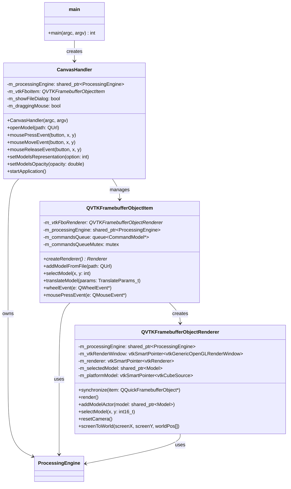
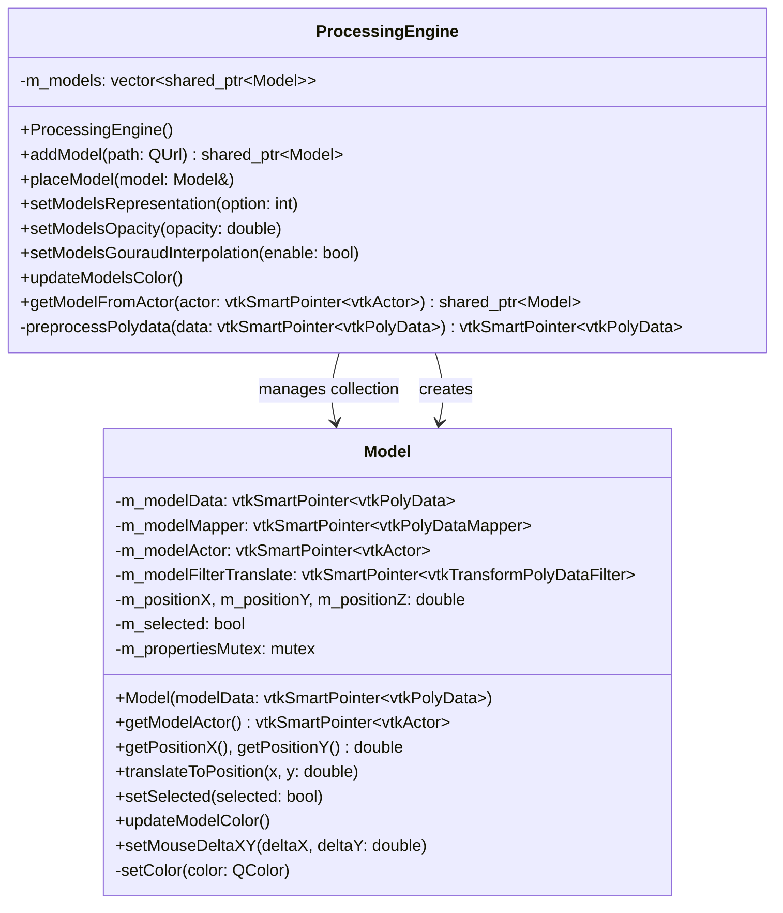
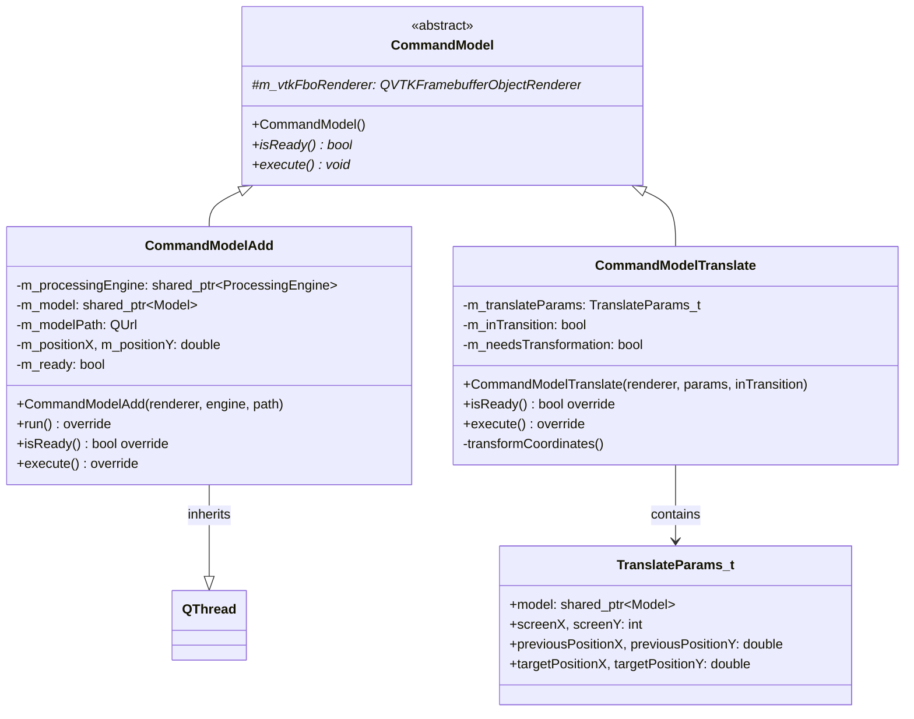
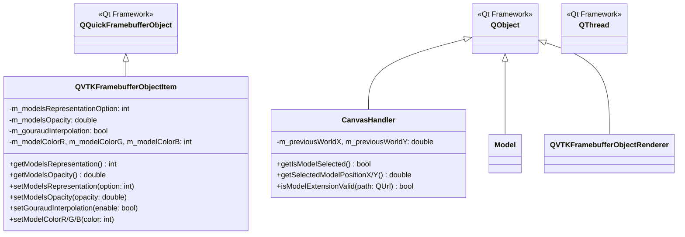
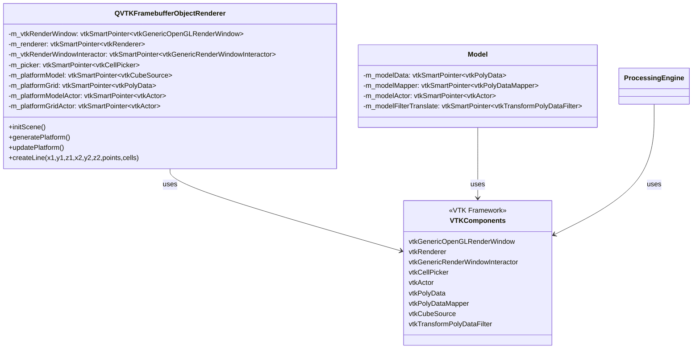
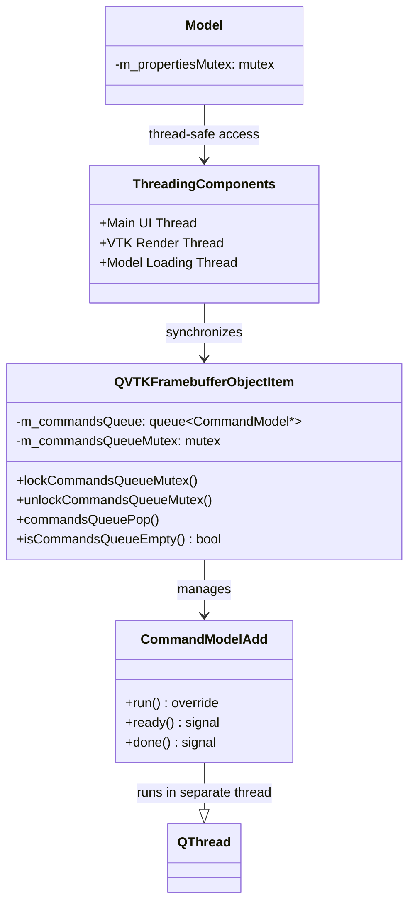

# QtVTK Project - High-Level UML Class Diagrams

## Overview
This QtVTK project is a 3D model viewer application that integrates Qt Quick with VTK (Visualization Toolkit) for rendering 3D models. The architecture follows a layered approach with clear separation between UI, rendering, and data processing concerns.

## 1. Main Architecture Overview

## 2. Data Model and Processing Layer

## 3. Command Pattern Implementation

## 4. Qt Integration and UI Layer

## 5. VTK Integration Layer

## 6. Threading and Synchronization

## Key Architecture Patterns

### 1. **MVC Pattern**
- **Model**: `Model` class represents 3D model data
- **View**: Qt Quick QML UI + VTK rendering
- **Controller**: `CanvasHandler` coordinates between UI and data

### 2. **Command Pattern**
- `CommandModel` abstract base class
- `CommandModelAdd` and `CommandModelTranslate` concrete implementations
- Command queue for asynchronous execution

### 3. **Observer Pattern**
- Qt signals/slots for UI updates
- Model position changes notify UI components

### 4. **Facade Pattern**
- `CanvasHandler` provides simplified interface to complex VTK operations
- `ProcessingEngine` encapsulates model processing logic

### 5. **Factory Pattern**
- `QVTKFramebufferObjectItem::createRenderer()` creates renderer instances

## Data Flow Summary

1. **User Interaction** → QML UI → `CanvasHandler`
2. **File Loading** → `CommandModelAdd` → `ProcessingEngine` → `Model`
3. **Model Manipulation** → `CommandModelTranslate` → `Model` → VTK Actors
4. **Rendering** → `QVTKFramebufferObjectRenderer` → VTK Pipeline → OpenGL
5. **UI Updates** → Qt Signals → QML Property Bindings

This architecture provides a clean separation of concerns with proper threading, command pattern for operations, and seamless Qt-VTK integration.